<h1 align="center">
  <br>
  <a href="https://github.com/epi052/feroxbuster"></a>
  <br>
</h1>

<h4 align="center">A simple, fast, recursive content discovery tool written in Rust</h4>

<p align="center">
  <a href="https://github.com/epi052/feroxbuster/actions?query=workflow%3A%22CI+Pipeline%22">
    
  </a>

  <a href="https://github.com/epi052/feroxbuster/releases">
    
  </a>

  <a href="https://github.com/epi052/feroxbuster/commits/master">
    
  </a>

  <a href="https://crates.io/crates/feroxbuster">
    
  </a>

  <a href="https://crates.io/crates/feroxbuster">
    
  </a>

  <a href="https://codecov.io/gh/epi052/feroxbuster">
    
  </a>
</p>

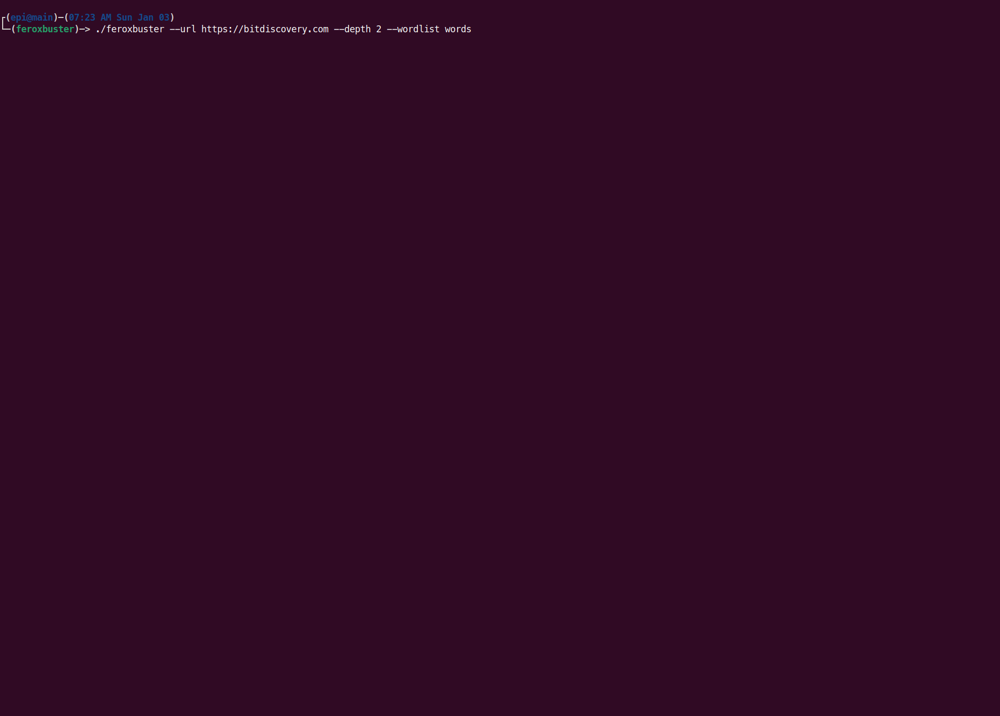

<p align="center">
  🦀
  <a href="https://github.com/epi052/feroxbuster/releases">Releases</a> ✨
  <a href="#-example-usage">Example Usage</a> ✨
  <a href="https://github.com/epi052/feroxbuster/blob/master/CONTRIBUTING.md">Contributing</a> ✨
  <a href="https://docs.rs/feroxbuster/latest/feroxbuster/">Documentation</a>
  🦀
</p>

## 😕 What the heck is a ferox anyway?

Ferox is short for Ferric Oxide. Ferric Oxide, simply put, is rust. The name rustbuster was taken, so I decided on a
variation. 🤷

## 🤔 What's it do tho?

`feroxbuster` is a tool designed to perform [Forced Browsing](https://owasp.org/www-community/attacks/Forced_browsing).

Forced browsing is an attack where the aim is to enumerate and access resources that are not referenced by the web
application, but are still accessible by an attacker.

`feroxbuster` uses brute force combined with a wordlist to search for unlinked content in target directories. These
resources may store sensitive information about web applications and operational systems, such as source code,
credentials, internal network addressing, etc...

This attack is also known as Predictable Resource Location, File Enumeration, Directory Enumeration, and Resource
Enumeration.

📖 Table of Contents
-----------------

- [Installation](#-installation)
    - [Download a Release](#download-a-release)
    - [Snap Install](#snap-install)
    - [Homebrew on MacOS and Linux](#homebrew-on-macos-and-linux)
    - [Cargo Install](#cargo-install)
    - [apt Install](#apt-install)
    - [AUR Install](#aur-install)
    - [Docker Install](#docker-install)
- [Configuration](#%EF%B8%8F-configuration)
    - [Default Values](#default-values)
    - [Threads and Connection Limits At A High-Level](#threads-and-connection-limits-at-a-high-level)
    - [ferox-config.toml](#ferox-configtoml)
    - [Command Line Parsing](#command-line-parsing)
- [Scan's Display Explained](#-scans-display-explained)
    - [Discovered Resource](#discovered-resource)
    - [Overall Scan Progress Bar](#overall-scan-progress-bar)
    - [Directory Scan Progress Bar](#directory-scan-progress-bar)
- [Example Usage](#-example-usage)
    - [Multiple Values](#multiple-values)
    - [Include Headers](#include-headers)
    - [IPv6, Non-recursive scan with INFO logging enabled](#ipv6-non-recursive-scan-with-info-level-logging-enabled)
    - [Read urls from STDIN; pipe only resulting urls out to another tool](#read-urls-from-stdin-pipe-only-resulting-urls-out-to-another-tool)
    - [Proxy traffic through Burp](#proxy-traffic-through-burp)
    - [Proxy traffic through a SOCKS proxy (including DNS lookups)](#proxy-traffic-through-a-socks-proxy-including-dns-lookups)
    - [Pass auth token via query parameter](#pass-auth-token-via-query-parameter)
    - [Extract Links from Response Body (new in `v1.1.0`)](#extract-links-from-response-body-new-in-v110)
    - [Limit Total Number of Concurrent Scans (new in `v1.2.0`)](#limit-total-number-of-concurrent-scans-new-in-v120)
    - [Filter Response by Status Code  (new in `v1.3.0`)](#filter-response-by-status-code--new-in-v130)
    - [Pause an Active Scan (new in `v1.4.0`)](#pause-an-active-scan-new-in-v140)
    - [Replay Responses to a Proxy based on Status Code (new in `v1.5.0`)](#replay-responses-to-a-proxy-based-on-status-code-new-in-v150)
    - [Filter Response by Word Count & Line Count  (new in `v1.6.0`)](#filter-response-by-word-count--line-count--new-in-v160)
    - [Filter Response Using a Regular Expression (new in `v1.8.0`)](#filter-response-using-a-regular-expression-new-in-v180)
    - [Stop and Resume Scans (save scan's state to disk) (new in `v1.9.0`)](#stop-and-resume-scans---resume-from-file-new-in-v190)
    - [Enforce a Time Limit on Your Scan (new in `v1.10.0`)](#enforce-a-time-limit-on-your-scan-new-in-v1100)
    - [Extract Links from robots.txt (New in `v1.10.2`)](#extract-links-from-robotstxt-new-in-v1102)
    - [Filter Response by Similarity to A Given Page (fuzzy filter) (new in `v1.11.0`)](#filter-response-by-similarity-to-a-given-page-fuzzy-filter-new-in-v1110)
    - [Cancel a Recursive Scan Interactively (new in `v1.12.0`)](#cancel-a-recursive-scan-interactively-new-in-v1120)
- [Comparison w/ Similar Tools](#-comparison-w-similar-tools)
- [Common Problems/Issues (FAQ)](#-common-problemsissues-faq)
    - [No file descriptors available](#no-file-descriptors-available)
    - [Progress bars print one line at a time](#progress-bars-print-one-line-at-a-time)
    - [What do each of the numbers beside the URL mean?](#what-do-each-of-the-numbers-beside-the-url-mean)
    - [Connection closed before message completed](#connection-closed-before-message-completed)
    - [SSL Error routines:tls_process_server_certificate:certificate verify failed](#ssl-error-routinestls_process_server_certificatecertificate-verify-failed)

## 💿 Installation

### Download a Release

Releases for multiple architectures can be found in the [Releases](https://github.com/epi052/feroxbuster/releases)
section. The latest release for each of the following systems can be downloaded and executed as shown below.

#### Linux (32 and 64-bit) & MacOS

```
curl -sL https://raw.githubusercontent.com/epi052/feroxbuster/master/install-nix.sh | bash
```

#### Windows x86

```
https://github.com/epi052/feroxbuster/releases/latest/download/x86-windows-feroxbuster.exe.zip
Expand-Archive .\feroxbuster.zip
.\feroxbuster\feroxbuster.exe -V
```

#### Windows x86_64

```
Invoke-WebRequest https://github.com/epi052/feroxbuster/releases/latest/download/x86_64-windows-feroxbuster.exe.zip -OutFile feroxbuster.zip
Expand-Archive .\feroxbuster.zip
.\feroxbuster\feroxbuster.exe -V
```

### Snap Install

Install using `snap`

```
sudo snap install feroxbuster
```

The only gotcha here is that the snap package can only read wordlists from a few specific locations. There are a few
possible solutions, of which two are shown below.

If the wordlist is on the same partition as your home directory, it can be hard-linked into `~/snap/feroxbuster/common`

```
ln /path/to/the/wordlist ~/snap/feroxbuster/common
./feroxbuster -u http://localhost -w ~/snap/feroxbuster/common/wordlist
``` 

If the wordlist is on a separate partition, hard-linking won't work. You'll need to copy it into the snap directory.

```
cp /path/to/the/wordlist ~/snap/feroxbuster/common
./feroxbuster -u http://localhost -w ~/snap/feroxbuster/common/wordlist
``` 

### Homebrew on MacOS and Linux

Install using Homebrew via tap

🍏 [MacOS](https://github.com/TGotwig/homebrew-feroxbuster/blob/main/feroxbuster.rb)

```shell
brew tap tgotwig/feroxbuster
brew install feroxbuster
```

🐧 [Linux](https://github.com/TGotwig/homebrew-linux-feroxbuster/blob/main/feroxbuster.rb)

```shell
brew tap tgotwig/linux-feroxbuster
brew install feroxbuster
```

### Cargo Install

`feroxbuster` is published on crates.io, making it easy to install if you already have rust installed on your system.

```
cargo install feroxbuster
```

### apt Install

Download `feroxbuster_amd64.deb` from the [Releases](https://github.com/epi052/feroxbuster/releases) section. After
that, use your favorite package manager to install the `.deb`.

```
wget -sLO https://github.com/epi052/feroxbuster/releases/latest/download/feroxbuster_amd64.deb.zip
unzip feroxbuster_amd64.deb.zip
sudo apt install ./feroxbuster_amd64.deb
```

### AUR Install

Install `feroxbuster-git` on Arch Linux with your AUR helper of choice:

```
yay -S feroxbuster-git
```

### Docker Install

> The following steps assume you have docker installed / setup

First, clone the repository.

```
git clone https://github.com/epi052/feroxbuster.git
cd feroxbuster
```

Next, build the image.

```
sudo docker build -t feroxbuster .
```

After that, you should be able to use `docker run` to perform scans with `feroxbuster`.

#### Basic usage

```
sudo docker run --init -it feroxbuster -u http://example.com -x js,html
```

#### Piping from stdin and proxying all requests through socks5 proxy

```
cat targets.txt | sudo docker run --net=host --init -i feroxbuster --stdin -x js,html --proxy socks5://127.0.0.1:9050
```

#### Mount a volume to pass in `ferox-config.toml`

You've got some options available if you want to pass in a config file.  [`ferox-buster.toml`](#ferox-configtoml) can
live in multiple locations and still be valid, so it's up to you how you'd like to pass it in. Below are a few valid
examples:

```
sudo docker run --init -v $(pwd)/ferox-config.toml:/etc/feroxbuster/ferox-config.toml -it feroxbuster -u http://example.com
```

```
sudo docker run --init -v ~/.config/feroxbuster:/root/.config/feroxbuster -it feroxbuster -u http://example.com
```

Note: If you are on a SELinux enforced system, you will need to pass the `:Z` attribute also.

```
docker run --init -v (pwd)/ferox-config.toml:/etc/feroxbuster/ferox-config.toml:Z -it feroxbuster -u http://example.com
```

#### Define an alias for simplicity

```
alias feroxbuster="sudo docker run --init -v ~/.config/feroxbuster:/root/.config/feroxbuster -i feroxbuster"
```

## ⚙️ Configuration

### Default Values

Configuration begins with with the following built-in default values baked into the binary:

- timeout: `7` seconds
- follow redirects: `false`
- wordlist: `/usr/share/seclists/Discovery/Web-Content/raft-medium-directories.txt`
- threads: `50`
- verbosity: `0` (no logging enabled)
- scan_limit: `0` (no limit imposed on concurrent scans)
- status_codes: `200 204 301 302 307 308 401 403 405`
- user_agent: `feroxbuster/VERSION`
- recursion depth: `4`
- auto-filter wildcards - `true`
- output: `stdout`
- save_state: `true` (create a state file in cwd when `Ctrl+C` is received)

### Threads and Connection Limits At A High-Level

This section explains how the `-t` and `-L` options work together to determine the overall aggressiveness of a scan. The
combination of the two values set by these options determines how hard your target will get hit and to some extent also
determines how many resources will be consumed on your local machine.

#### A Note on Green Threads

`feroxbuster` uses so-called [green threads](https://en.wikipedia.org/wiki/Green_threads) as opposed to traditional
kernel/OS threads. This means (at a high-level) that the threads are implemented entirely in userspace, within a single
running process. As a result, a scan with 30 green threads will appear to the OS to be a single process with no
additional light-weight processes associated with it as far as the kernel is concerned. As such, there will not be any
impact to process (`nproc`) limits when specifying larger values for `-t`. However, these threads will still consume
file descriptors, so you will need to ensure that you have a suitable `nlimit` set when scaling up the amount of
threads. More detailed documentation on setting appropriate `nlimit` values can be found in
the [No File Descriptors Available](#no-file-descriptors-available) section of the FAQ

#### Threads and Connection Limits: The Implementation

* Threads: The `-t` option specifies the maximum amount of active threads *per-directory* during a scan
* Connection Limits: The `-L` option specifies the maximum amount of active connections per thread

#### Threads and Connection Limits: Examples

To truly have only 30 active requests to a site at any given time, `-t 30 -L 1` is necessary. Using `-t 30 -L 2` will
result in a maximum of 60 total requests being processed at any given time for that site. And so on. For a conversation
on this, please see [Issue #126](https://github.com/epi052/feroxbuster/issues/126) which may provide more (or less)
clarity :wink:

### ferox-config.toml

After setting built-in default values, any values defined in a `ferox-config.toml` config file will override the
built-in defaults.

`feroxbuster` searches for `ferox-config.toml` in the following locations (in the order shown):

- `/etc/feroxbuster/` (global)
- `CONFIG_DIR/feroxbuster/` (per-user)
- The same directory as the `feroxbuster` executable (per-user)
- The user's current working directory (per-target)

> `CONFIG_DIR` is defined as the following:
> - Linux: `$XDG_CONFIG_HOME` or `$HOME/.config` i.e. `/home/bob/.config`
> - MacOs: `$HOME/Library/Application Support` i.e. `/Users/bob/Library/Application Support`
> - Windows: `{FOLDERID_RoamingAppData}` i.e. `C:\Users\Bob\AppData\Roaming`

If more than one valid configuration file is found, each one overwrites the values found previously.

If no configuration file is found, nothing happens at this stage.

As an example, let's say that we prefer to use a different wordlist as our default when scanning; we can set
the `wordlist` value in the config file to override the baked-in default.

Notes of interest:

- it's ok to only specify values you want to change without specifying anything else
- variable names in `ferox-config.toml` must match their command-line counterpart

```toml
# ferox-config.toml

wordlist = "/wordlists/jhaddix/all.txt"
```

A pre-made configuration file with examples of all available settings can be found in `ferox-config.toml.example`.

```toml
# ferox-config.toml
# Example configuration for feroxbuster
#
# If you wish to provide persistent settings to feroxbuster, rename this file to ferox-config.toml and make sure
# it resides in the same directory as the feroxbuster binary.
#
# After that, uncomment any line to override the default value provided by the binary itself.
#
# Any setting used here can be overridden by the corresponding command line option/argument
#
# wordlist = "/wordlists/jhaddix/all.txt"
# status_codes = [200, 500]
# filter_status = [301]
# threads = 1
# timeout = 5
# proxy = "http://127.0.0.1:8080"
# replay_proxy = "http://127.0.0.1:8081"
# replay_codes = [200, 302]
# verbosity = 1
# scan_limit = 6
# quiet = true
# json = true
# output = "/targets/ellingson_mineral_company/gibson.txt"
# debug_log = "/var/log/find-the-derp.log"
# user_agent = "Mozilla/5.0 (Windows NT 6.1; Win64; x64; rv:47.0) Gecko/20100101 Firefox/47.0"
# redirects = true
# insecure = true
# extensions = ["php", "html"]
# no_recursion = true
# add_slash = true
# stdin = true
# dont_filter = true
# extract_links = true
# depth = 1
# filter_size = [5174]
# filter_regex = ["^ignore me$"]
# filter_similar = ["https://somesite.com/soft404"]
# filter_word_count = [993]
# filter_line_count = [35, 36]
# queries = [["name","value"], ["rick", "astley"]]
# save_state = false
# time_limit = 10m

# headers can be specified on multiple lines or as an inline table
#
# inline example
# headers = {"stuff" = "things"}
#
# multi-line example
#   note: if multi-line is used, all key/value pairs under it belong to the headers table until the next table
#         is found or the end of the file is reached
#
# [headers]
# stuff = "things"
# more = "headers"
```

### Command Line Parsing

Finally, after parsing the available config file, any options/arguments given on the commandline will override any
values that were set as a built-in or config-file value.

```
USAGE:
    feroxbuster [FLAGS] [OPTIONS] --url <URL>...

FLAGS:
    -f, --add-slash        Append / to each request
    -D, --dont-filter      Don't auto-filter wildcard responses
    -e, --extract-links    Extract links from response body (html, javascript, etc...); make new requests based on
                           findings (default: false)
    -h, --help             Prints help information
    -k, --insecure         Disables TLS certificate validation
        --json             Emit JSON logs to --output and --debug-log instead of normal text
    -n, --no-recursion     Do not scan recursively
    -q, --quiet            Only print URLs; Don't print status codes, response size, running config, etc...
    -r, --redirects        Follow redirects
        --stdin            Read url(s) from STDIN
    -V, --version          Prints version information
    -v, --verbosity        Increase verbosity level (use -vv or more for greater effect. [CAUTION] 4 -v's is probably
                           too much)

OPTIONS:
        --debug-log <FILE>                        Output file to write log entries (use w/ --json for JSON entries)
    -d, --depth <RECURSION_DEPTH>
            Maximum recursion depth, a depth of 0 is infinite recursion (default: 4)

    -x, --extensions <FILE_EXTENSION>...          File extension(s) to search for (ex: -x php -x pdf js)
    -N, --filter-lines <LINES>...                 Filter out messages of a particular line count (ex: -N 20 -N 31,30)
    -X, --filter-regex <REGEX>...
            Filter out messages via regular expression matching on the response's body (ex: -X '^ignore me$')

        --filter-similar-to <UNWANTED_PAGE>...
            Filter out pages that are similar to the given page (ex. --filter-similar-to http://site.xyz/soft404)

    -S, --filter-size <SIZE>...                   Filter out messages of a particular size (ex: -S 5120 -S 4927,1970)
    -C, --filter-status <STATUS_CODE>...          Filter out status codes (deny list) (ex: -C 200 -C 401)
    -W, --filter-words <WORDS>...                 Filter out messages of a particular word count (ex: -W 312 -W 91,82)
    -H, --headers <HEADER>...                     Specify HTTP headers (ex: -H Header:val 'stuff: things')
    -o, --output <FILE>                           Output file to write results to (use w/ --json for JSON entries)
    -p, --proxy <PROXY>
            Proxy to use for requests (ex: http(s)://host:port, socks5(h)://host:port)

    -Q, --query <QUERY>...                        Specify URL query parameters (ex: -Q token=stuff -Q secret=key)
    -R, --replay-codes <REPLAY_CODE>...
            Status Codes to send through a Replay Proxy when found (default: --status-codes value)

    -P, --replay-proxy <REPLAY_PROXY>
            Send only unfiltered requests through a Replay Proxy, instead of all requests

        --resume-from <STATE_FILE>
            State file from which to resume a partially complete scan (ex. --resume-from ferox-1606586780.state)

    -L, --scan-limit <SCAN_LIMIT>                 Limit total number of concurrent scans (default: 0, i.e. no limit)
    -s, --status-codes <STATUS_CODE>...
            Status Codes to include (allow list) (default: 200 204 301 302 307 308 401 403 405)

    -t, --threads <THREADS>                       Number of concurrent threads (default: 50)
        --time-limit <TIME_SPEC>                  Limit total run time of all scans (ex: --time-limit 10m)
    -T, --timeout <SECONDS>                       Number of seconds before a request times out (default: 7)
    -u, --url <URL>...                            The target URL(s) (required, unless --stdin used)
    -a, --user-agent <USER_AGENT>                 Sets the User-Agent (default: feroxbuster/VERSION)
    -w, --wordlist <FILE>                         Path to the wordlist

```

## 📊 Scan's Display Explained

`feroxbuster` attempts to be intuitive and easy to understand, however, if you are wondering about any of the scan's
output and what it means, this is the section for you!  

### Discovered Resource

When `feroxbuster` finds a response that you haven't filtered out, it's reported above the progress bars and looks similar to what's pictured below.  

The number of lines, words, and bytes shown here can be used to [filter those responses](#filter-response-by-word-count--line-count--new-in-v160)

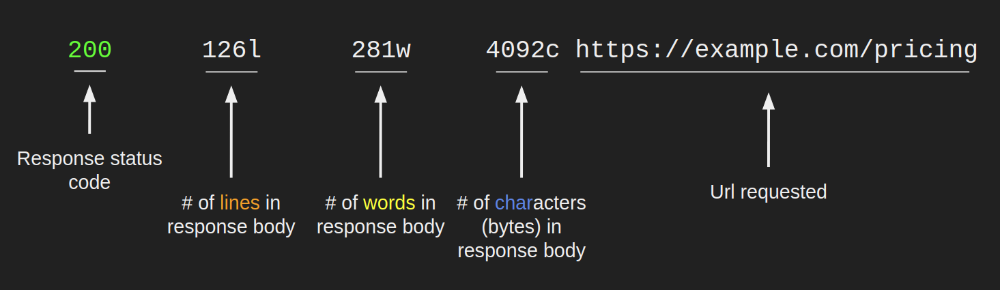

### Overall Scan Progress Bar

The top progress bar, colored yellow, tracks the overall scan status.  Its fields are described in the image below.

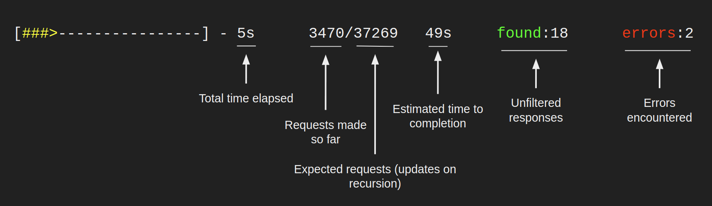

### Directory Scan Progress Bar

All other progress bars, colored cyan, represent a scan of one particular directory and will look similar to what's below.   

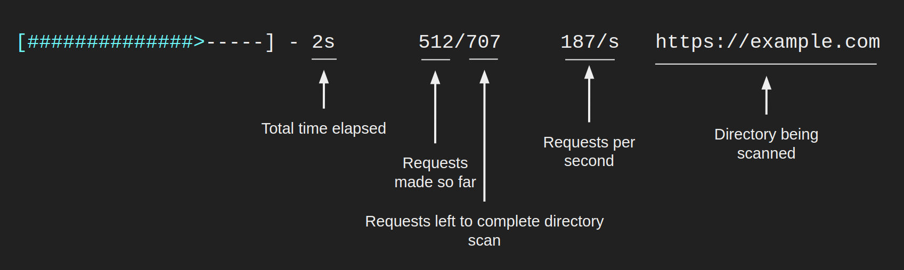

## 🧰 Example Usage

### Multiple Values

Options that take multiple values are very flexible. Consider the following ways of specifying extensions:

```
./feroxbuster -u http://127.1 -x pdf -x js,html -x php txt json,docx
```

The command above adds .pdf, .js, .html, .php, .txt, .json, and .docx to each url

All of the methods above (multiple flags, space separated, comma separated, etc...) are valid and interchangeable. The
same goes for urls, headers, status codes, queries, and size filters.

### Include Headers

```
./feroxbuster -u http://127.1 -H Accept:application/json "Authorization: Bearer {token}"
```

### IPv6, non-recursive scan with INFO-level logging enabled

```
./feroxbuster -u http://[::1] --no-recursion -vv
```

### Read urls from STDIN; pipe only resulting urls out to another tool

```
cat targets | ./feroxbuster --stdin --quiet -s 200 301 302 --redirects -x js | fff -s 200 -o js-files
```

### Proxy traffic through Burp

```
./feroxbuster -u http://127.1 --insecure --proxy http://127.0.0.1:8080
```

### Proxy traffic through a SOCKS proxy (including DNS lookups)

```
./feroxbuster -u http://127.1 --proxy socks5h://127.0.0.1:9050
```

### Pass auth token via query parameter

```
./feroxbuster -u http://127.1 --query token=0123456789ABCDEF
```

### Extract Links from Response Body (New in `v1.1.0`)

Search through the body of valid responses (html, javascript, etc...) for additional endpoints to scan. This turns
`feroxbuster` into a hybrid that looks for both linked and unlinked content.

Example request/response with `--extract-links` enabled:

- Make request to `http://example.com/index.html`
- Receive, and read in, the `body` of the response
- Search the `body` for absolute and relative links (i.e. `homepage/assets/img/icons/handshake.svg`)
- Add the following directories for recursive scanning:
    - `http://example.com/homepage`
    - `http://example.com/homepage/assets`
    - `http://example.com/homepage/assets/img`
    - `http://example.com/homepage/assets/img/icons`
- Make a single request to `http://example.com/homepage/assets/img/icons/handshake.svg`

```
./feroxbuster -u http://127.1 --extract-links
```

Here's a comparison of a wordlist-only scan vs `--extract-links`
using [Feline](https://www.hackthebox.eu/home/machines/profile/274) from Hack the Box:

Wordlist only

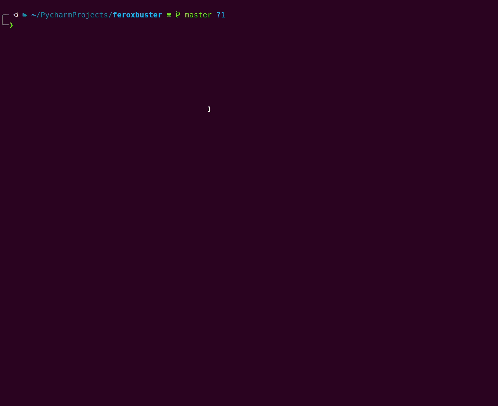

With `--extract-links`

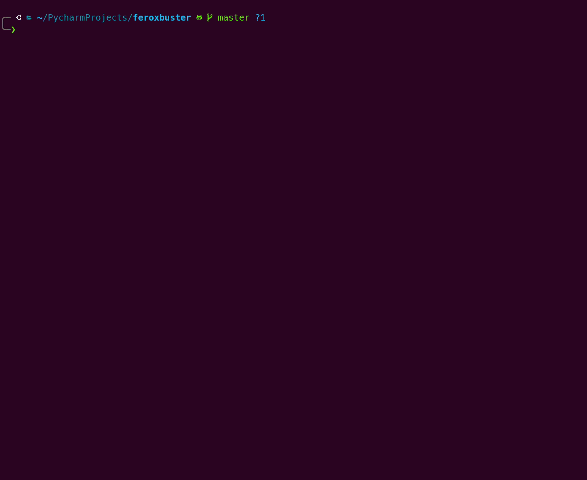

### Limit Total Number of Concurrent Scans (new in `v1.2.0`)

Limit the number of scans permitted to run at any given time. Recursion will still identify new directories, but newly
discovered directories can only begin scanning when the total number of active scans drops below the value passed to
`--scan-limit`.

```
./feroxbuster -u http://127.1 --scan-limit 2
```

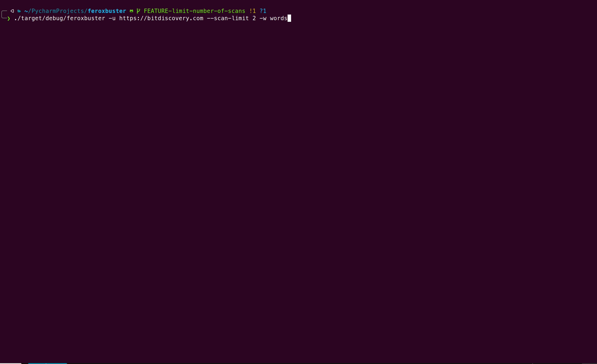

### Filter Response by Status Code  (new in `v1.3.0`)

Version 1.3.0 included an overhaul to the filtering system which will allow for a wide array of filters to be added with
minimal effort. The first such filter is a Status Code Filter. As responses come back from the scanned server, each one
is checked against a list of known filters and either displayed or not according to which filters are set.

```
./feroxbuster -u http://127.1 --filter-status 301
```

### Pause an Active Scan (new in `v1.4.0`)

**NOTE**: [v1.12.0](#cancel-a-recursive-scan-interactively-new-in-v1120) added an interactive menu to the pause/resume
functionality.  Active scans can still be paused, however, now you're presented with the option to cancel a scan instead
of simply seeing a spinner.

Scans can be paused and resumed by pressing the ENTER key (~~shown below~~, please see [v1.12.0](#cancel-a-recursive-scan-interactively-new-in-v1120)'s entry for the latest visual representation)

### Replay Responses to a Proxy based on Status Code (new in `v1.5.0`)

The `--replay-proxy` and `--replay-codes` options were added as a way to only send a select few responses to a proxy.
This is in stark contrast to `--proxy` which proxies EVERY request.

Imagine you only care about proxying responses that have either the status code `200` or `302` (or you just don't want
to clutter up your Burp history). These two options will allow you to fine-tune what gets proxied and what doesn't.

```
./feroxbuster -u http://127.1 --replay-proxy http://localhost:8080 --replay-codes 200 302 --insecure
```

Of note: this means that for every response that matches your replay criteria, you'll end up sending the request that
generated that response a second time. Depending on the target and your engagement terms (if any), it may not make sense
from a traffic generated perspective.

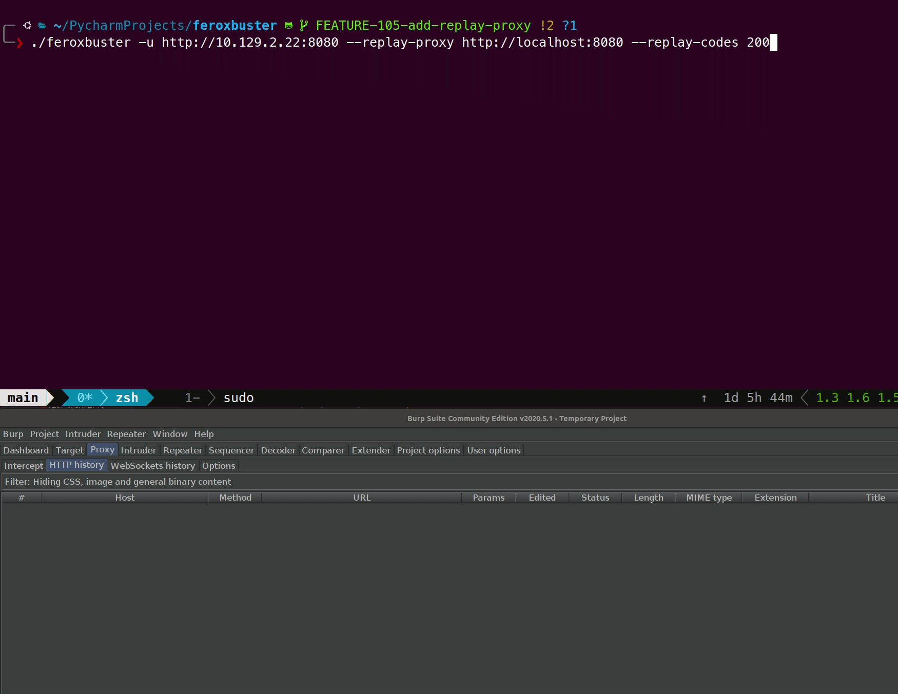

### Filter Response by Word Count & Line Count  (new in `v1.6.0`)

In addition to filtering on the size of a response, version 1.6.0 added the ability to filter out responses based on the
number of lines and/or words contained within the response body. This change drove a change to the information displayed
to the user as well. This section will detail the new information and how to make use of it with the new filters
provided.

Example output:

```
200        10l        212w       38437c https://example-site.com/index.html
```

There are five columns of output above:

- column 1: status code - can be filtered with `-C|--filter-status`
- column 2: number of lines - can be filtered with `-N|--filter-lines`
- column 3: number of words - can be filtered with `-W|--filter-words`
- column 4: number of bytes (overall size) - can be filtered with `-S|--filter-size`
- column 5: url to discovered resource

### Filter Response Using a Regular Expression (new in `v1.8.0`)

Version 1.3.0 included an overhaul to the filtering system which will allow for a wide array of filters to be added with
minimal effort. The latest addition is a Regular Expression Filter. As responses come back from the scanned server,
the **body** of the response is checked against the filter's regular expression. If the expression is found in the body,
then that response is filtered out.

**NOTE: Using regular expressions to filter large responses or many regular expressions may negatively impact
performance.**

```
./feroxbuster -u http://127.1 --filter-regex '[aA]ccess [dD]enied.?' --output results.txt --json
```

### Stop and Resume Scans (`--resume-from FILE`) (new in `v1.9.0`)

Version 1.9.0 adds a few features that allow for completely stopping a scan, and resuming that same scan from a file on
disk.

A simple `Ctrl+C` during a scan will create a file that contains information about the scan that was cancelled.

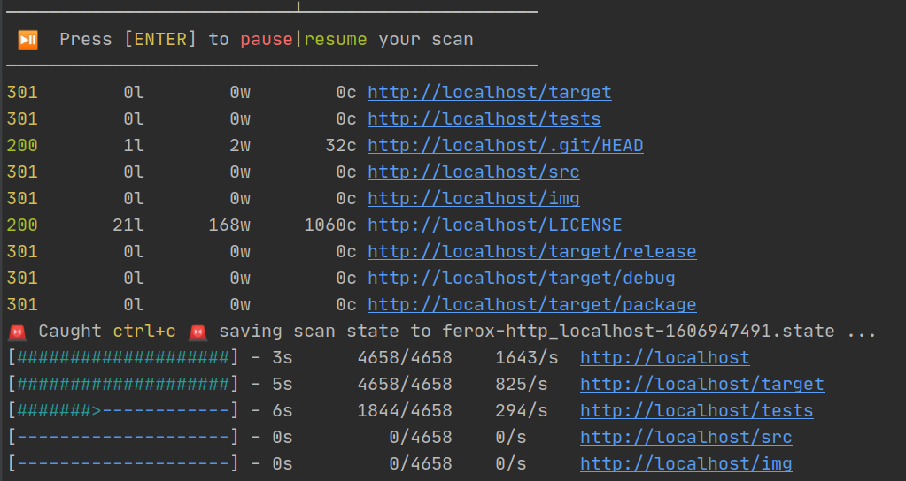

```json
// example snippet of state file

{
  "scans": [
    {
      "id": "057016a14769414aac9a7a62707598cb",
      "url": "https://localhost.com",
      "scan_type": "Directory",
      "complete": true
    },
    {
      "id": "400b2323a16f43468a04ffcbbeba34c6",
      "url": "https://localhost.com/css",
      "scan_type": "Directory",
      "complete": false
    }
  ],
  "config": {
    "wordlist": "/wordlists/seclists/Discovery/Web-Content/common.txt",
    "...": "..."
  },
  "responses": [
    {
      "type": "response",
      "url": "https://localhost.com/Login",
      "path": "/Login",
      "wildcard": false,
      "status": 302,
      "content_length": 0,
      "line_count": 0,
      "word_count": 0,
      "headers": {
        "content-length": "0",
        "server": "nginx/1.16.1"
      }
    }
  ]
},
```

Based on the example image above, the same scan can be resumed by
using `feroxbuster --resume-from ferox-http_localhost-1606947491.state`. Directories that were already complete are not
rescanned, however partially complete scans are started from the beginning.

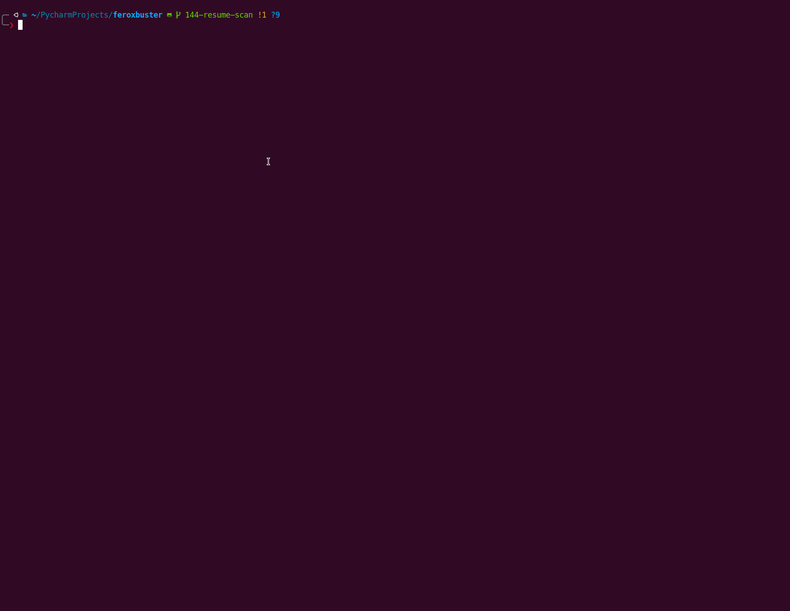

In order to prevent state file creation when `Ctrl+C` is pressed, you can simply add the entry below to
your `ferox-config.toml`.

```toml
# ferox-config.toml

save_state = false
```

### Enforce a Time Limit on Your Scan (new in `v1.10.0`)

Version 1.10.0 adds the ability to set a maximum runtime, or time limit, on your scan. The usage is pretty simple: a
number followed directly by a single character representing seconds, minutes, hours, or days.  `feroxbuster` refers to
this combination as a time_spec.

Examples of possible time_specs:

- `30s` - 30 seconds
- `20m` - 20 minutes
- `1h`  - 1 hour
- `1d`  - 1 day (why??)

A valid time_spec can be passed to `--time-limit` in order to force a shutdown after the given time has elapsed.

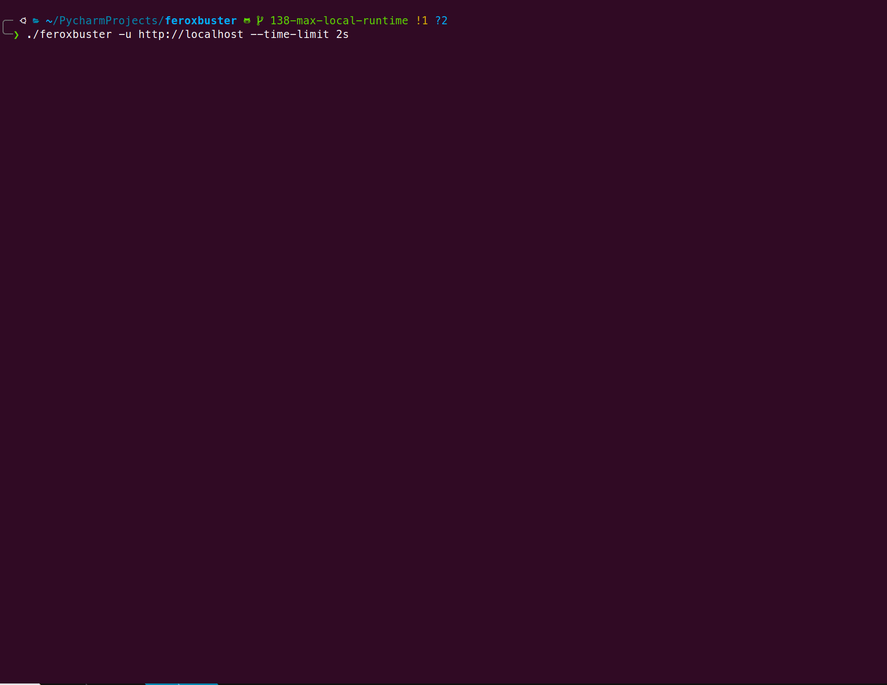

### Extract Links from robots.txt (New in `v1.10.2`)

In addition to [extracting links from the response body](#extract-links-from-response-body-new-in-v110), using
`--extract-links` makes a request to `/robots.txt` and examines all `Allow` and `Disallow` entries. Directory entries
are added to the scan queue, while file entries are requested and then reported if appropriate.

### Filter Response by Similarity to A Given Page (fuzzy filter) (new in `v1.11.0`)

Version 1.11.0 adds the ability to specify an example page for filtering pages that are similar to the given example.

For example, consider a site that attempts to redirect new users to a `/register` endpoint. The `/register` page has a
CSRF token that alters the page's response slightly with each new request (sometimes affecting overall length). This
means that a simple line/word/char filter won't be able to filter all responses. In order to filter those redirects out,
one could use a command like this:

```
./feroxbuster -u https://somesite.xyz --filter-similar-to https://somesite.xyz/register
```

`--filter-similar-to` requests the page passed to it via CLI (`https://somesite.xyz/register`), after which it hashes 
the response body using the [SSDeep algorithm](https://ssdeep-project.github.io/ssdeep/index.html).  All subsequent 
pages are hashed and compared to the original request's hash. If the comparison of the two hashes meets a certain 
percentage of similarity (currently 95%), then that request will be filtered out.

SSDeep was selected as it does a good job of identifying near-duplicate pages once content-length reaches a certain 
size, while remaining performant.  Other algorithms were tested but resulted in huge performance hits (orders of 
magnitude slower on requests/second).

**NOTE**
- SSDeep/`--filter-similar-to` does not do well at detecting similarity of very small responses
  - The lack of accuracy with very small responses is considered a fair trade-off for not negatively impacting performance
- Using a bunch of `--filter-similar-to` values **may** negatively impact performance

### Cancel a Recursive Scan Interactively (new in `v1.12.0`)

Version 1.12.0 expanded the pause/resume functionality introduced in [v1.4.0](#pause-an-active-scan-new-in-v140) by 
adding an interactive menu from which currently running recursive scans can be cancelled, without affecting the overall scan.  Scans can still be paused indefinitely by pressing `ENTER`, however, the   

Scans that are started via `-u` or passed in through `--stdin` cannot be cancelled, only scans found via `--extract-links` or recursion are eligible.

Below is an example of the Scan Cancel Menu™.

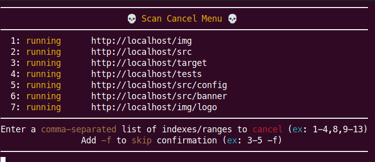

Using the menu is pretty simple:
- Press `ENTER` to view the menu
- Choose a scan to cancel by entering its scan index (`1`)
  - more than one scan can be selected by using a comma-separated list (`1,2,3` ... etc)
- Confirm selections, after which all non-cancelled scans will resume

Here is a short demonstration of cancelling two in-progress scans found via recursion.

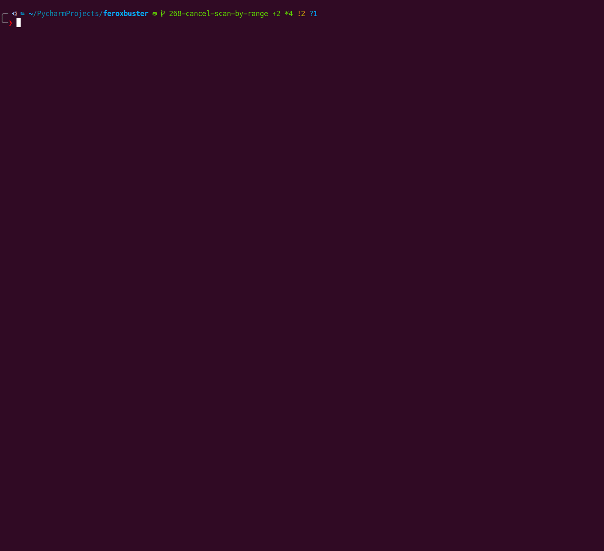

## 🧐 Comparison w/ Similar Tools

There are quite a few similar tools for forced browsing/content discovery. Burp Suite Pro, Dirb, Dirbuster, etc...
However, in my opinion, there are two that set the standard: [gobuster](https://github.com/OJ/gobuster) and
[ffuf](https://github.com/ffuf/ffuf). Both are mature, feature-rich, and all-around incredible tools to use.

So, why would you ever want to use feroxbuster over ffuf/gobuster? In most cases, you probably won't. ffuf in particular
can do the vast majority of things that feroxbuster can, while still offering boatloads more functionality. Here are a
few of the use-cases in which feroxbuster may be a better fit:

- You want a **simple** tool usage experience
- You want to be able to run your content discovery as part of some crazy 12 command unix **pipeline extravaganza**
- You want to scan through a **SOCKS** proxy
- You want **auto-filtering** of Wildcard responses by default
- You want an integrated **link extractor/robots.txt parser** to increase discovered endpoints
- You want **recursion** along with some other thing mentioned above (ffuf also does recursion)
- You want a **configuration file** option for overriding built-in default values for your scans

|                                                          | feroxbuster | gobuster | ffuf |
|------------------------------------------------------------------------------|---|---|---|
| fast                                                                         | ✔ | ✔ | ✔ |
| allows recursion                                                             | ✔ |   | ✔ |
| can specify query parameters                                                 | ✔ |   | ✔ |
| SOCKS proxy support                                                          | ✔ |   |   |
| multiple target scan (via stdin or multiple -u)                              | ✔ |   | ✔ |
| configuration file for default value override                                | ✔ |   | ✔ |
| can accept urls via STDIN as part of a pipeline                              | ✔ |   | ✔ |
| can accept wordlists via STDIN                                               |   | ✔ | ✔ |
| filter based on response size, wordcount, and linecount                      | ✔ |   | ✔ |
| auto-filter wildcard responses                                               | ✔ |   | ✔ |
| performs other scans (vhost, dns, etc)                                       |   | ✔ | ✔ |
| time delay / rate limiting                                                   |   | ✔ | ✔ |
| extracts links from response body to increase scan coverage (`v1.1.0`)       | ✔ |   |   |
| limit number of concurrent recursive scans (`v1.2.0`)                        | ✔ |   |   |
| filter out responses by status code (`v1.3.0`)                               | ✔ | ✔ | ✔ |
| interactive pause and resume of active scan (`v1.4.0`)                       | ✔ |   |   |
| replay only matched requests to a proxy (`v1.5.0`)                           | ✔ |   | ✔ |
| filter out responses by line & word count (`v1.6.0`)                         | ✔ |   | ✔ |
| json output (ffuf supports other formats as well) (`v1.7.0`)                 | ✔ |   | ✔ |
| filter out responses by regular expression (`v1.8.0`)                        | ✔ |   | ✔ |
| save scan's state to disk (can pick up where it left off) (`v1.9.0`)         | ✔ |   |   |
| maximum run time limit (`v1.10.0`)                                           | ✔ |   | ✔ |
| use robots.txt to increase scan coverage (`v1.10.2`)                         | ✔ |   |   |
| use example page's response to fuzzily filter similar pages  (`v1.11.0`)     | ✔ |   |   |
| cancel a recursive scan interactively (`v1.12.0`)                            | ✔ |   |   |
| **huge** number of other options                                             |   |   | ✔ |

Of note, there's another written-in-rust content discovery tool, [rustbuster](https://github.com/phra/rustbuster). I
came across rustbuster when I was naming my tool (😢). I don't have any experience using it, but it appears to be able
to do POST requests with an HTTP body, has SOCKS support, and has an 8.3 shortname scanner (in addition to vhost dns,
directory, etc...). In short, it definitely looks interesting and may be what you're looking for as it has some
capability I haven't seen in similar tools.

## 🤯 Common Problems/Issues (FAQ)

### No file descriptors available

Why do I get a bunch of `No file descriptors available (os error 24)` errors?

---

There are a few potential causes of this error. The simplest is that your operating system sets an open file limit that
is aggressively low. Through personal testing, I've found that `4096` is a reasonable open file limit (this will vary
based on your exact setup).

There are quite a few options to solve this particular problem, of which a handful are shown below.

#### Increase the Number of Open Files

We'll start by increasing the number of open files the OS allows. On my Kali install, the default was `1024`, and I know
some MacOS installs use `256` 😕.

##### Edit `/etc/security/limits.conf`

One option to up the limit is to edit `/etc/security/limits.conf` so that it includes the two lines below.

- `*` represents all users
- `hard` and `soft` indicate the hard and soft limits for the OS
- `nofile` is the number of open files option.

```
/etc/security/limits.conf
-------------------------
...
*        soft nofile 4096
*        hard nofile 8192
...
```

##### Use `ulimit` directly

A faster option, that is **not** persistent, is to simply use the `ulimit` command to change the setting.

```
ulimit -n 4096
```

#### Additional Tweaks (may not be needed)

If you still find yourself hitting the file limit with the above changes, there are a few additional tweaks that may
help.

> This section was shamelessly stolen from this [stackoverflow answer](https://stackoverflow.com/a/3923785). More information is included in that post and is recommended reading if you end up needing to use this section.

✨ Special thanks to HTB user [@sparkla](https://www.hackthebox.eu/home/users/profile/221599) for their help with
identifying these additional tweaks ✨

##### Increase the ephemeral port range, and decrease the tcp_fin_timeout.

The ephermal port range defines the maximum number of outbound sockets a host can create from a particular I.P. address.
The fin_timeout defines the minimum time these sockets will stay in TIME_WAIT state (unusable after being used once).
Usual system defaults are

- `net.ipv4.ip_local_port_range = 32768   61000`
- `net.ipv4.tcp_fin_timeout = 60`

This basically means your system cannot consistently guarantee more than `(61000 - 32768) / 60 = 470` sockets per
second.

```
sudo sysctl net.ipv4.ip_local_port_range="15000 61000"
sudo sysctl net.ipv4.tcp_fin_timeout=30
```

##### Allow socket reuse while in a `TIME_WAIT` status

This allows fast cycling of sockets in time_wait state and re-using them. Make sure to read
post [Coping with the TCP TIME-WAIT](https://vincent.bernat.ch/en/blog/2014-tcp-time-wait-state-linux) from Vincent
Bernat to understand the implications.

```
sudo sysctl net.ipv4.tcp_tw_reuse=1 
```

### Progress bars print one line at a time

`feroxbuster` needs a terminal width of at least the size of what's being printed in order to do progress bar printing
correctly. If your width is too small, you may see output like what's shown below.

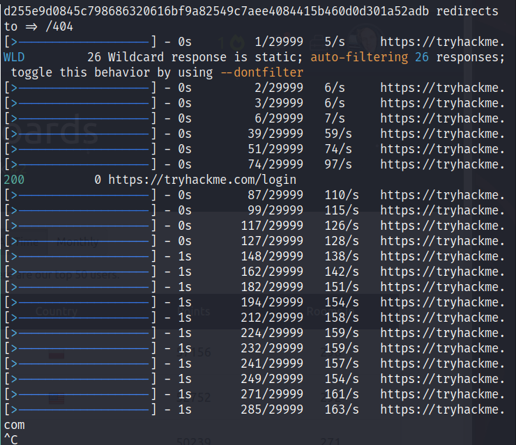

If you can, simply make the terminal wider and rerun. If you're unable to make your terminal wider consider using `-q`
to suppress the progress bars.

### What do each of the numbers beside the URL mean?

Please refer to [this section](#filter-response-by-word-count--line-count--new-in-v160) where each number's meaning and
how to use it to filter responses is discussed.

### Connection closed before message completed

The error in question can be boiled down to 'networking stuff'. `feroxbuster`
uses [reqwest](https://docs.rs/reqwest/latest/) which uses [hyper](https://docs.rs/hyper/latest/hyper/) to make requests
to the server. [This issue report](https://github.com/hyperium/hyper/issues/2136#issuecomment-589345238) to the hyper
project explains what is happening (quoted below to save you a click). This isn't a bug so much as it's a
target-specific tuning issue. When lowering the `-t` value, the error doesn't occur (or happens much less frequently).

This isn't a bug. Simply slow down the scan. A `-t` value of 50 was chosen as a sane default that's still quite fast out
of the box. However, network related errors may occur when the client and/or server become over-saturated.
The [Threads and Connection Limits At A High-Level](#threads-and-connection-limits-at-a-high-level) section details how
to accomplish per-target tuning.

> This is just due to the racy nature of networking.
>
> hyper has a connection pool of idle connections, and it selected one to send your request. Most of the time, hyper will receive the server's FIN and drop the dead connection from its pool. But occasionally, a connection will be selected from the pool and written to at the same time the server is deciding to close the connection. Since hyper already wrote some of the request, it can't really retry it automatically on a new connection, since the server may have acted already.

### SSL Error routines:tls_process_server_certificate:certificate verify failed

In the event you see an error similar to

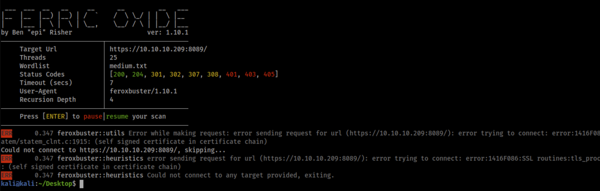

```
error trying to connect: error:1416F086:SSL routines:tls_process_server_certificate:certificate verify failed:ssl/statem/statem_clnt.c:1913: (self signed certificate)
```

You just need to add the `-k|--insecure` flag to your command.

`feroxbuster` rejects self-signed certs and other "insecure" certificates/site configurations by default. You can choose
to scan these services anyway by telling `feroxbuster` to ignore insecure server certs.
